# WSL (Windows Sub System for Linux) 설치
# windows store에서 ubuntu 설치

* windows 키를 누른 후 store 검색

  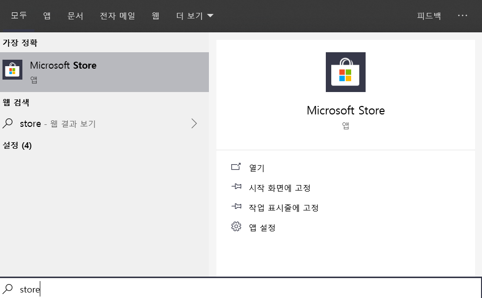

* ubuntu app 설치

  

* appwiz.cpl 실행

  

* 프로그램 및 기능에서 wRindows 기능 켜기/

* 끄기를 통해 Windows Sub System 설치

  * <u>재부팅이 필요하니 부팅전에 저장할 파일들은 모두 저장해주세요\~</u>

  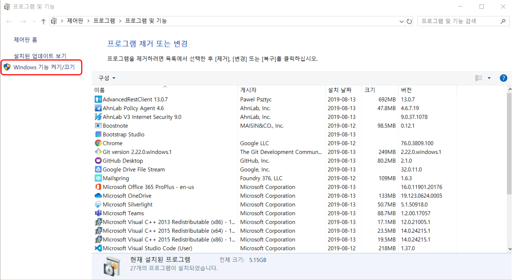

  

* ubuntu app 실행 및 ID와 Password 설정

  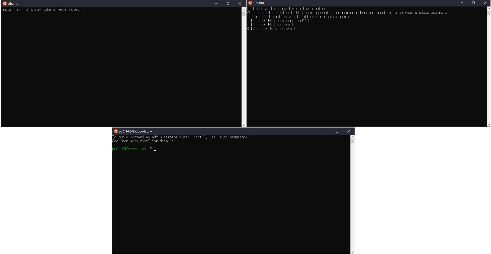

* ubuntu update

  * 다음 명령어를 통해 ubuntu를 업데이트 한다.

  ```bash
  sudo apt-get update
  sudo apt-get upgrade
  ```

# 컴파일러 및 빌드 툴 설치

* ubuntu app에서 컴파일러를 설치한다.

  * 컴파일러는 gcc/gpp, clang 등 다양한 컴파일러가 있으니 자신이 좋아하는 컴파일러를 설치한다.

  * 여기에서는 [clang](https://ko.wikipedia.org/wiki/%ED%81%B4%EB%9E%AD) 컴파일러를 설치함

  ```bash
  sudo apt-get install clang llvm
  ```
  
* 빌드의 편의를 위해 BUILD ESSENTIAL 및 Scons와 같은 툴들을 설치한다.

  * 자신이 좋아하는 툴 및 라이브러리가 있다면 함께 설치하도록 한다.

  ```bash
  sudo apt-get install \
  	build-essential git scons libtool autoconf \
  	valgrind doxygen wget unzip chrpath
  ```

# vscode 설치 및 설정

* vscode는 마이크로소프트에서 제작한 code editor이자 개발도구로 아래의 사이트에서 자세한 사항을 확인할 수 있으며, 다운로드 받을 수도 있다.

  * https://code.visualstudio.com/

* vscode 설치가 완료되면 c/c++ 개발을 위한 설정을 수행한다.

  * plugin 설치 - 다음 2개의 plugin을 설치한다.

    * Remote-WSL

    * c/c++

    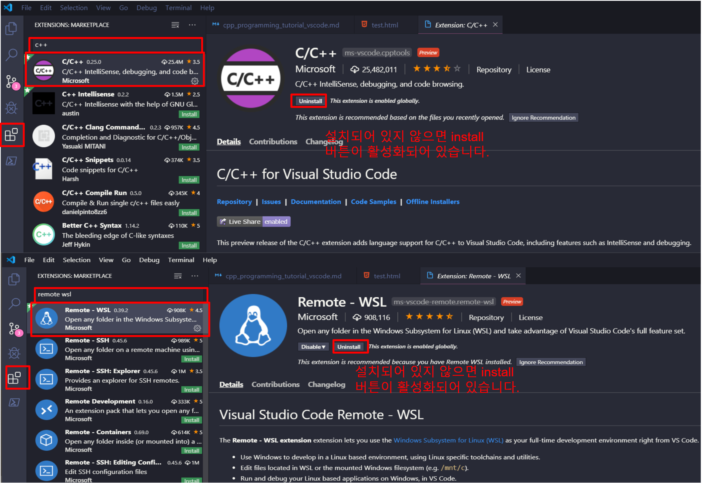

  * plugin 설치가 완료되면 vscode를 재실행 합니다.

# 프로젝트 생성

* project를 생성할 폴더를 생성해준다.

  * ubuntu app을 실행한 후 `mkdir cpp-test` 명령어를 통해 cpp-test 디렉터리를 생성한다.

    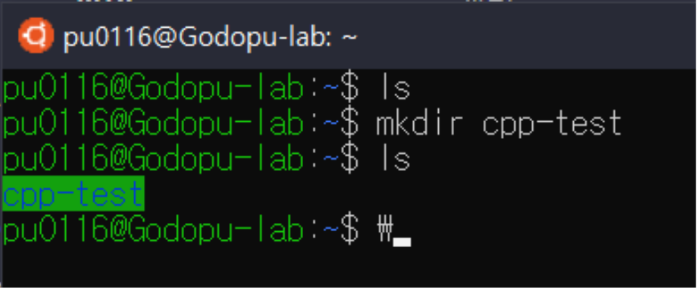

* remote-wsl 플러그인을 사용하여 ubuntu 환경에서 project를 생성해준다.

  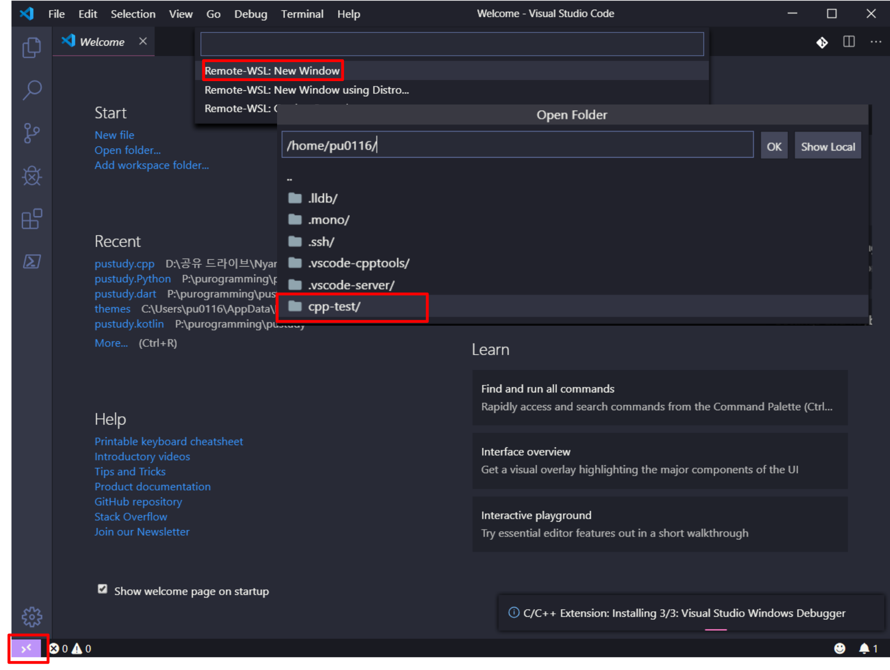

* .gitignore 파일을 생성한 후 .vscode 폴더를 추가한다. (git을 사용하지 않을 사람은 하지 않아도 됨)

  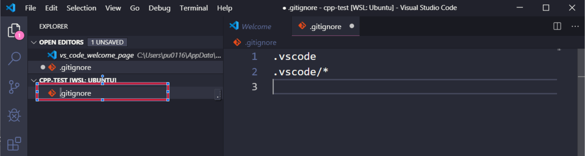

* C++ 작업환경을 구성한다.

  * `Ctrl + Shift + P`를 누른 후 `C/C++: Edit` 을 입력한 후 `C/C++: Edit Configurations` 항목을 선택

    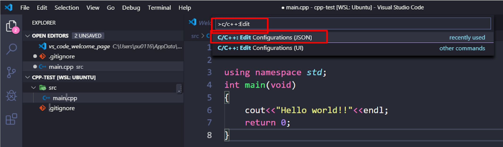

  * .vscode 디렉터리 내에 c_cpp_properties.json 파일이 생성되는 것을 확인한 후 자신이 원하는 환경으로 설정한다.

    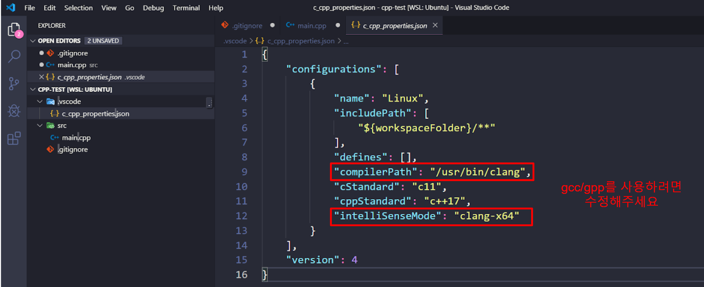

* 소스코드를 작성한다.

  * src 폴더를 생성하고 그 안에 main.cpp 파일을 생성하여 다음 코드를 작성한다.

    ```c++
    #include <iostream>
    
    using namespace std;
    
    int main(void)
    {
        cout << "Hello world!!" << endl;
        return 0;
    }
    
    ```

    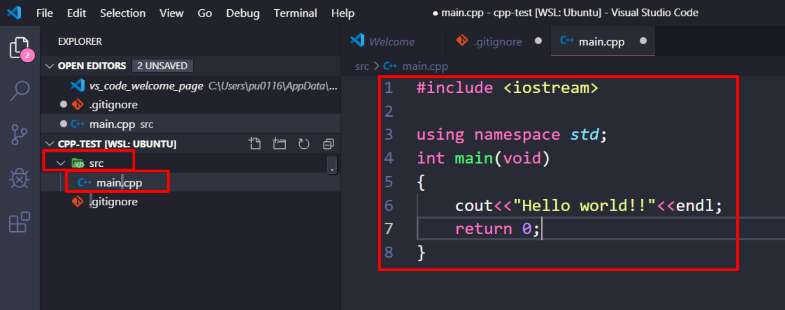

* 빌드

  * 빌드를 위해 Tasks.json파일을 생성한다.

    * 반드시 .cpp 파일을 선택한 후 아래의 절차를 실행할 것!!

    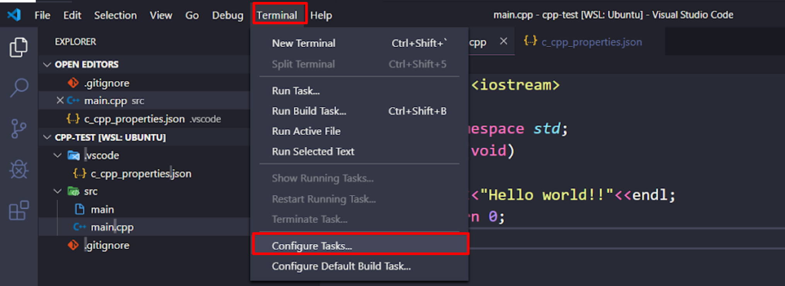****

    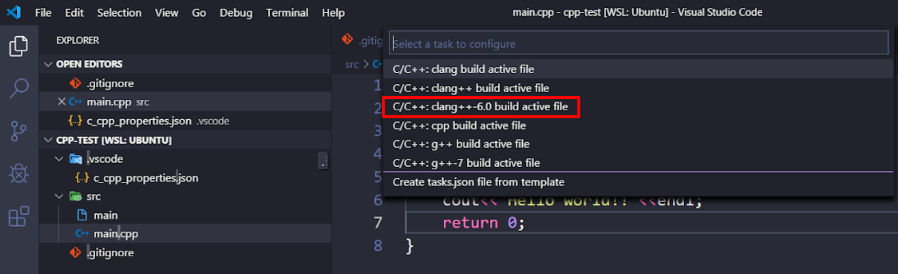

    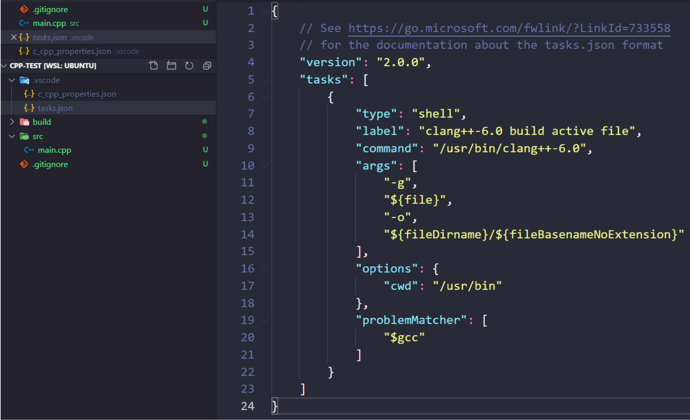

  * 빌드를 수행한다.(<u>Ctrl + Shift + B</u>)

    * Tasks.json 파일은 빌드 방식을 포함하고 있는 파일로 Tasks.json 파일에 여러가지 빌드 방식을 추가할 수 있으며, 다음의 절차로 추가한 빌드 방식 중 1가지를 사용해 빌드를 수행할 수 있다. <u>(Run Build task 하는게 없음)</u>

      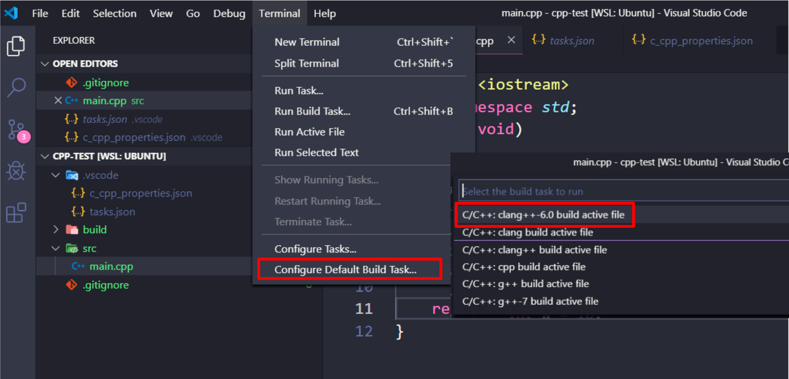

    * main 파일이 생성된 것을 확인한다.

      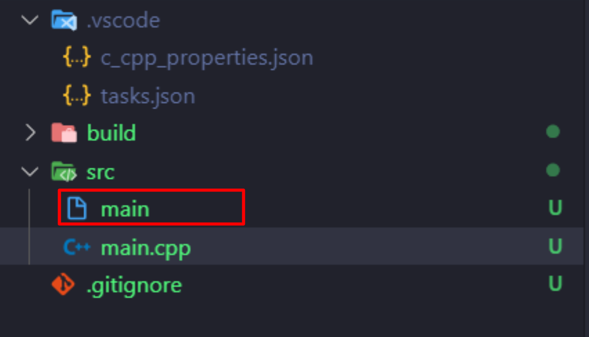

* 디버그

  * 빌드의 방식이 tasks.json 파일에 저장되듯이 디버깅 방식은 launch.json 파일에 저장된다. 다음 절차를 따라하여 launch.json파일을 생성한다.

    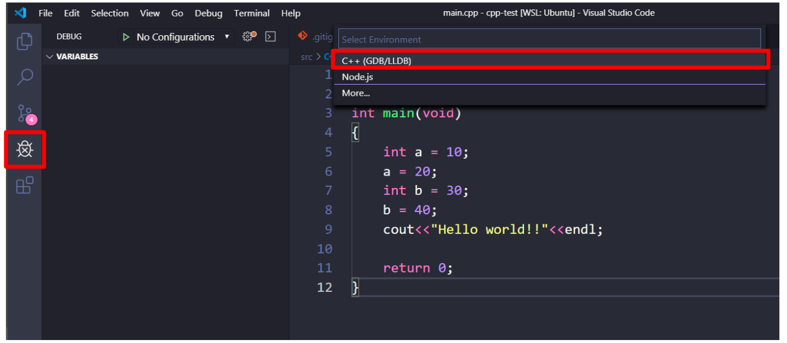

    * Program 속성을 다음과 같이 수정한다.

      `"program" : "${fileDirname}/${fileBasenameNoExtension}"`

    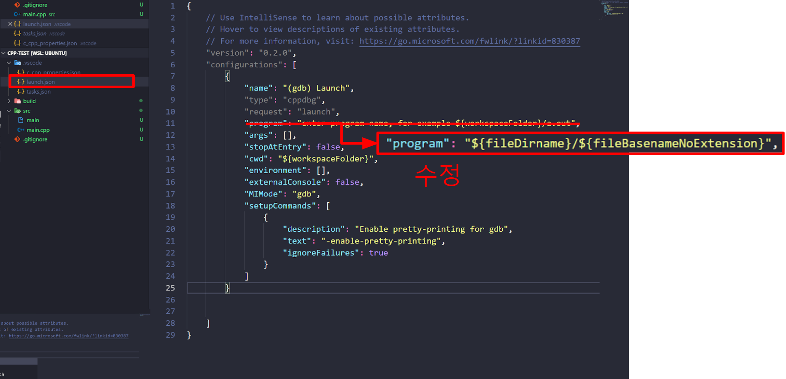

  * F5를 누르면 디버깅이 수행된다.

    * BreakPoint를 찍어 제대로 작동하는지 확인한다.

      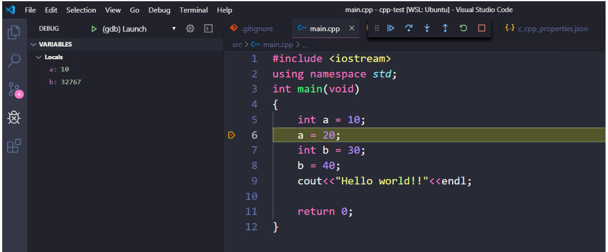

# 소스 파일이 여러개면...

# ref

* https://github.com/Microsoft/vscode-cpptools/releases

* https://code.visualstudio.com/docs/cpp/config-wsl

* https://codeday.me/ko/qa/20190627/905798.html

* <https://m.blog.naver.com/PostView.nhn?blogId=stupidus85&logNo=70133129470&proxyReferer=https%3A%2F%2Fwww.google.com%2F>

* <https://pkgpl.org/2014/07/27/sconstruct_basic/>

* <https://clee.tistory.com/88>

* <https://wiki.iotivity.org/build_iotivity_with_ubuntu_build_machine>

* <http://egloos.zum.com/bruceKIM/v/3399880>

* <http://egloos.zum.com/bruceKIM/v/3399880>

* <https://hongku.tistory.com/70>

* <https://scons.org/doc/0.97/HTML/scons-user/x628.html>
